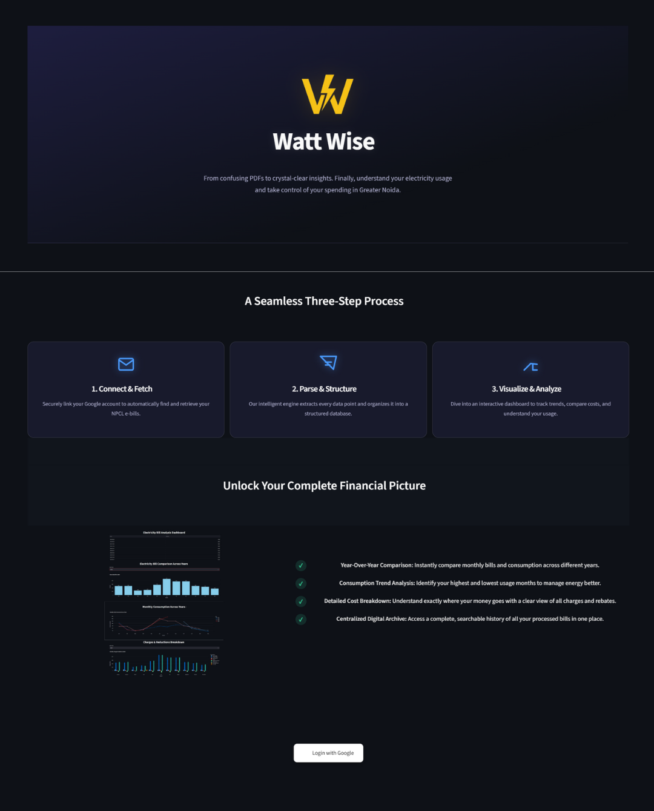
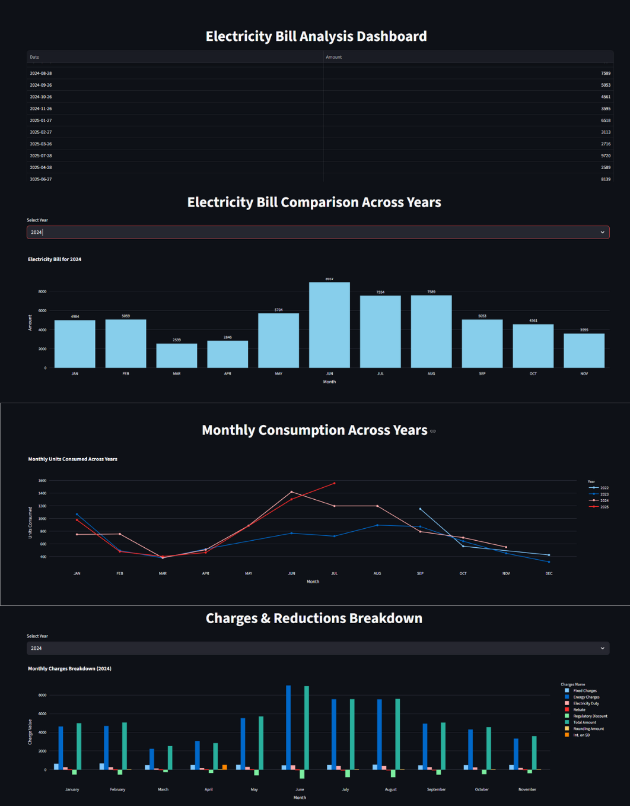

# Watt Wise: Electricity Bill Analyzer

Watt Wise is a web application built with Streamlit that transforms your Noida Power Company Limited (NPCL) electricity bill PDFs into an interactive, visual dashboard. It automates the entire process of collecting, parsing, and analyzing your electricity bills, providing clear insights into your usage and spending patterns.
<p align="center">
  
</p>
<p align="center">
  
</p>
How It Works
The application follows a simple, three-step user journey:

+ Login with Google: Securely connect your Google account to grant the app read-only access to find your NPCL e-bills.

+ Auto-Scan & Extract: The app automatically finds your e-bill PDFs in Gmail and extracts key data like consumption units, charges, and bill dates.

+ Visualize Data: Your bill information is organized and displayed on an interactive dashboard, allowing you to easily track spending and usage trends.

### Key Features

* Automated Data Extraction: Eliminates the need for manual data entry by automatically processing PDF bills from Gmail.

* Historical Analysis: Compares electricity consumption and costs across different months and years to identify trends.

* Interactive Dashboard: Features dynamic bar charts and line graphs for intuitive data exploration.

* Detailed Cost Breakdown: Clearly visualizes all components of the bill, including fixed charges, energy charges, duties, and rebates.

* Secure & User-Friendly: Utilizes a secure Google login and provides a clean, modern user interface.

### Technology Stack
* Web Framework: Streamlit

* Data Extraction: pdfplumber, Regular Expressions (re)

* Database: MySQL (mysql-connector-python)

* Authentication: Google OAuth (google-auth-oauthlib)

* API Interaction: Google API Client (googleapiclient)

* Data Visualization: Plotly Express

* Data Manipulation: Pandas
## Getting Started
Getting Started
Follow these instructions to get the Watt Wise application running on your local machine for development and testing purposes.

Prerequisites
Before you begin, ensure you have the following installed:

+ Python 3.8+

+ Git for cloning the repository.

+ Access to a MySQL database.
Installation & Setup
  Open your terminal and clone the project repository:
  ### 1. Clone the repository
    git clone https://github.com/Shivang0105/electricity_bill_analyser.git
 ### 2. Install Dependencies
    pip install -r requirements.txt
 ### 3. Google API Credentials
+ Enable the Gmail API in your Google Cloud Console.
+ Create OAuth 2.0 Client ID credentials for a "Desktop app".
+ Download the JSON file, rename it to credentials.json, and place it in the project's root directory.
 ### 4. Database Configuration
 The application uses Streamlit's secrets management for database credentials. Create a file at .streamlit/secrets.toml and add your database connection details:
```
toml
[database]
host = "YOUR_DATABASE_HOST"
port = 3306
user = "YOUR_DATABASE_USERNAME"
password = "YOUR_DATABASE_PASSWORD"
name = "YOUR_DATABASE_NAME"
```
### Running the Application
Once the setup is complete, you can launch the Streamlit app from your terminal:
```
streamlit run app.py
```


## Usage
Once the application is running, follow these steps to analyze your electricity bills:

### 1. Launch the Application
After running streamlit run app.py, the application will open in a new tab in your web browser. You will be greeted with the Watt Wise homepage.

### 2. Authenticate with Google
Click on the "Login with Google" button. You will be redirected to a Google authentication screen. Select the account where you receive your NPCL e-bills and grant the necessary permissions. This is a secure, read-only access.

### 3. Fetch and Process Invoices
Once logged in, you will see a welcome message. Click the "⚡ Process Invoices Now" button. The application will then:

* Scan your Gmail for emails containing NPCL electricity bills.

* Download the PDF attachments.

* Extract all relevant data and save it to the database.

* A success message will appear when the process is complete.

### 4. Explore the Dashboard
After processing, you will be taken to the main dashboard where you can:

* View your complete bill history in a table.

* Select a year to see a month-by-month breakdown of your bill amounts.

* Analyze your consumption trends over time with an interactive line chart.

* Examine a detailed breakdown of charges and rebates for any given month.

### 5. Logout
When you are finished, you can click the "Logout" button to securely end your session.
